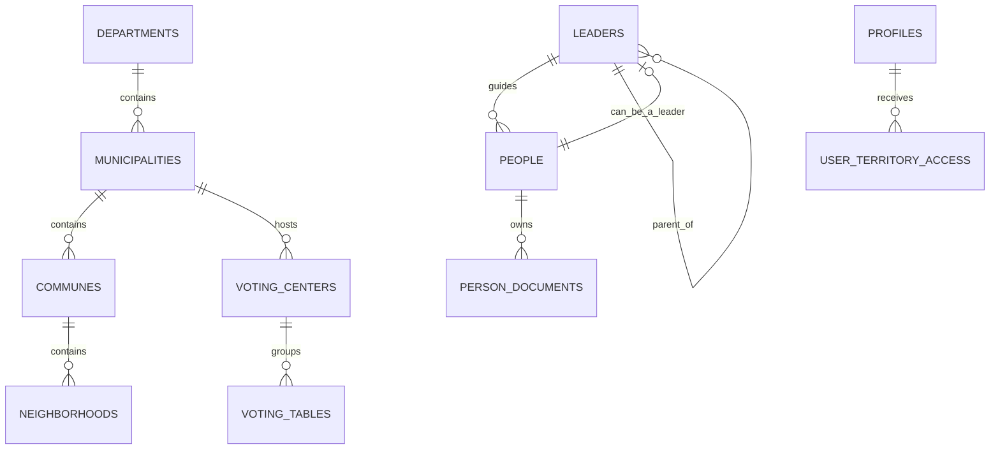

# Modelo de Base de Datos

## Estrategia

Se propone un diseño PostgreSQL normalizado y compacto con entidades geográficas, personas, líderes, documentos, fechas importantes, formularios y usuarios.

## Entidades principales

### Geografía

- departments
- municipalities
- communes
- neighborhoods
- voting_centers
- voting_tables

### Núcleo CRM

- people
- leaders
- leader_assignments
- person_tags
- person_documents

### Alertas y operación

- important_dates

### Captación pública

- public_submissions

### Seguridad y trazabilidad

- profiles
- user_territory_access

## Relaciones clave

- Un departamento tiene muchos municipios.
- Un municipio tiene muchas comunas.
- Una comuna tiene muchos barrios.
- Una persona puede tener un líder asociado.
- Un líder pertenece a una persona y puede tener un líder padre.
- Una persona puede tener múltiples documentos.
- Un usuario del sistema tiene un rol y puede tener acceso territorial asignado.

## Entidades sugeridas

### profiles

Perfil de aplicación vinculado a `auth.users`.

Campos: `id`, `full_name`, `role`, `status`, `avatar_url`, `created_at`, `updated_at`.
Campos operativos adicionales: `email`, `username`, `territory`, `can_manage_alerts`, `dashboard_preferences`.

### people

Entidad central del CRM.

Campos: `id`, `document_number`, `first_name`, `last_name`, `phone`, `whatsapp`, `email`, `address`, `profession`, `company`, `job_title`, `employment_status`, `voting_place`, `voting_table`, `leader_id`, `photo_path`, `resume_path`, `notes`, `visibility_scope`, `created_at`, `updated_at`.
La relación `leader_id` permite saber qué líder mueve o acompaña a cada persona.

### leaders

Núcleo jerárquico político.

Campos: `id`, `person_id`, `parent_leader_id`, `leader_level`, `territorial_scope`, `influence_score`, `active`.
El título del líder puede guardar el sector visible, por ejemplo `Líder Bajo Tablazo`.

### person_documents

Gestión documental con Supabase Storage.

Campos: `id`, `person_id`, `document_type`, `storage_bucket`, `storage_path`, `mime_type`, `size_bytes`, `visibility_scope`, `created_at`.

### important_dates

Fechas y alertas administrables para cumpleaños, días profesionales, días cívicos o campañas.

Campos: `id`, `title`, `date_type`, `date_month`, `date_day`, `exact_date`, `channel`, `audience_scope`, `message_template`, `active`, `created_by`, `approved_by`.

## Mermaid ER

## Seguridad y permisos

- RLS activado en todas las tablas sensibles.
- Escritura restringida por rol.
- Lectura parcial para secretaría y abogados.
- Lectura territorial limitada para coordinadores.
- Los cambios sensibles pueden auditarse en una etapa posterior si se requiere.
