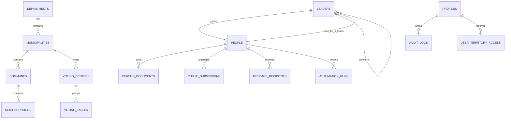

# Modelo de Base de Datos

## Estrategia

Se propone un diseño PostgreSQL normalizado con entidades geográficas, personas, líderes, documentos, automatizaciones, formularios y auditoría.

## Entidades principales

### Geografía

- departments
- municipalities
- communes
- neighborhoods
- voting_centers
- voting_tables

### Núcleo CRM

- people
- leaders
- leader_assignments
- person_tags
- person_documents
- document_assets

### Operación política

- campaigns
- campaign_segments
- automation_templates
- automation_rules
- automation_runs
- message_batches
- message_recipients

### Captación pública

- public_submissions
- public_submission_events

### Seguridad y trazabilidad

- profiles
- admin_invitations
- user_territory_access
- audit_logs

## Relaciones clave

- Un departamento tiene muchos municipios.
- Un municipio tiene muchas comunas.
- Una comuna tiene muchos barrios.
- Una persona puede tener un líder asociado.
- Un líder pertenece a una persona y puede tener un líder padre.
- Una persona puede tener múltiples documentos.
- Un usuario del sistema tiene un rol y puede tener acceso territorial asignado.

## Entidades sugeridas

### profiles

Perfil de aplicación vinculado a `auth.users`.

Campos: `id`, `full_name`, `role`, `status`, `avatar_url`, `created_at`, `updated_at`.

### people

Entidad central del CRM.

Campos: `id`, `document_number`, `first_name`, `last_name`, `phone`, `whatsapp`, `email`, `address`, `profession`, `company`, `job_title`, `employment_status`, `voting_place`, `voting_table`, `leader_id`, `photo_path`, `resume_path`, `notes`, `visibility_scope`, `created_at`, `updated_at`.

### leaders

Núcleo jerárquico político.

Campos: `id`, `person_id`, `parent_leader_id`, `leader_level`, `territorial_scope`, `influence_score`, `active`.

### person_documents

Gestión documental con Supabase Storage.

Campos: `id`, `person_id`, `document_type`, `storage_bucket`, `storage_path`, `mime_type`, `size_bytes`, `visibility_scope`, `created_at`.

### automation_templates

Plantillas reutilizables para cumpleaños, profesión o campañas.

Campos: `id`, `name`, `channel`, `trigger_type`, `subject`, `body`, `variables_schema`, `active`.

### important_dates

Fechas y alertas administrables para cumpleaños, días profesionales, días cívicos o campañas.

Campos: `id`, `title`, `date_type`, `date_month`, `date_day`, `exact_date`, `channel`, `audience_scope`, `message_template`, `active`, `created_by`, `approved_by`.

### admin_invitations

Invitaciones y trazabilidad previa a la creación de usuarios reales.

Campos: `id`, `email`, `full_name`, `role`, `status`, `invited_by`, `accepted_user_id`, `expires_at`.

### audit_logs

Registro de cambios sensibles.

Campos: `id`, `actor_user_id`, `entity_table`, `entity_id`, `action`, `before_state`, `after_state`, `metadata`, `created_at`.

## Mermaid ER

## Seguridad y permisos

- RLS activado en todas las tablas sensibles.
- Escritura restringida por rol.
- Lectura parcial para secretaría y abogados.
- Lectura territorial limitada para coordinadores.
- Auditoría obligatoria en cambios de personas, líderes, documentos y campañas.
