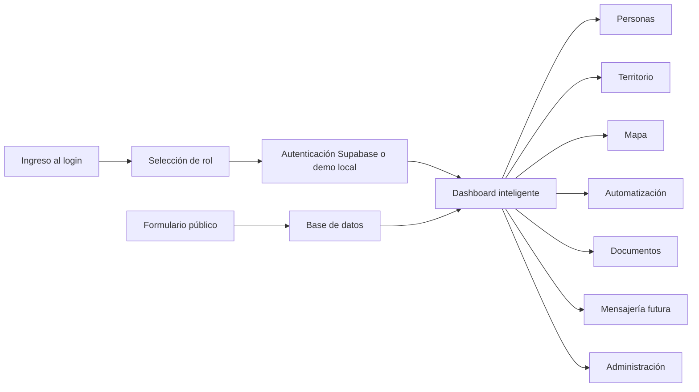

# Flujo del Sistema

## Flujo principal

## Secuencia operacional

1. El usuario entra al sistema.
2. Selecciona o valida su rol.
3. El backend determina permisos y alcance territorial.
4. El dashboard resume métricas, territorio y actividad reciente.
5. El usuario navega hacia personas, líderes, documentos o campañas.
6. El administrador crea usuarios, asigna roles y configura alertas importantes.
7. Las acciones quedan auditadas.
8. Los formularios públicos inyectan registros al CRM.
9. Las automatizaciones se programan para ejecución posterior.

## Flujo futuro de mensajería

1. Se define plantilla.
2. Se selecciona segmento.
3. Se programa canal.
4. Se genera lote.
5. Se registra trazabilidad de envío.
